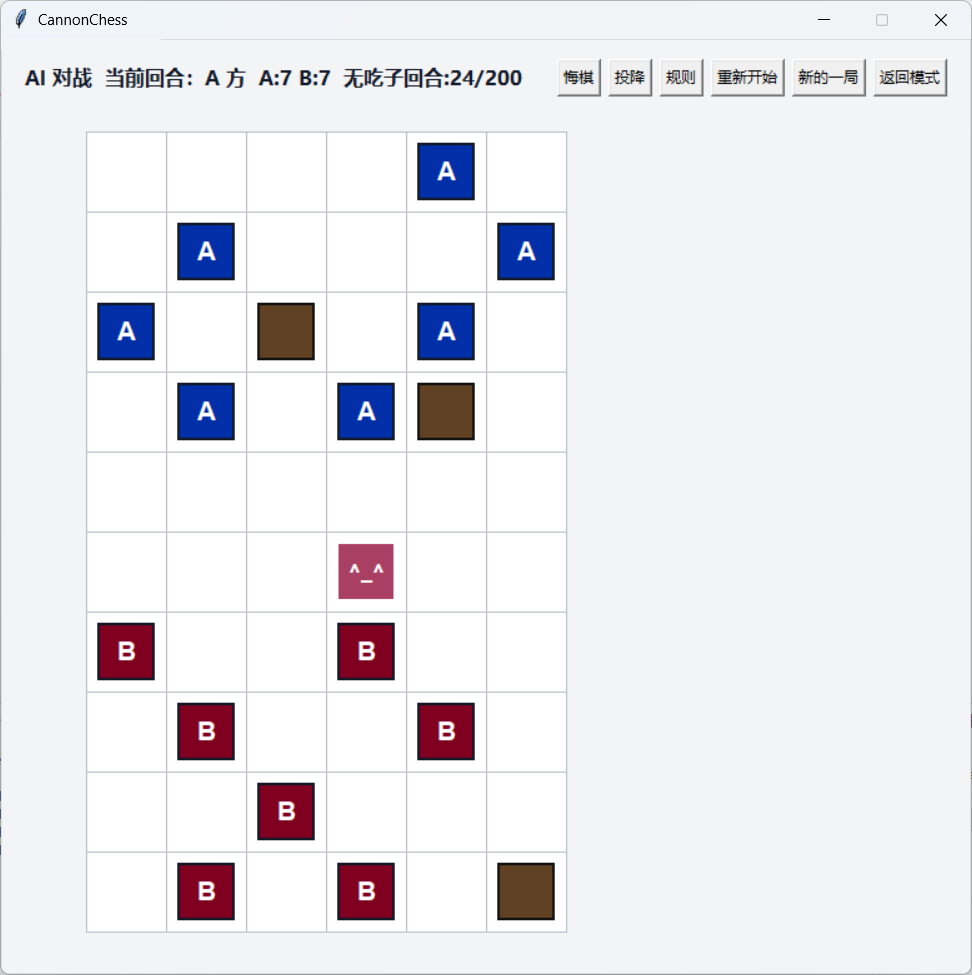
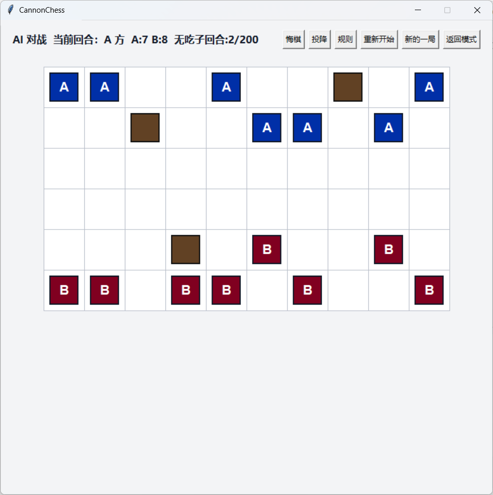
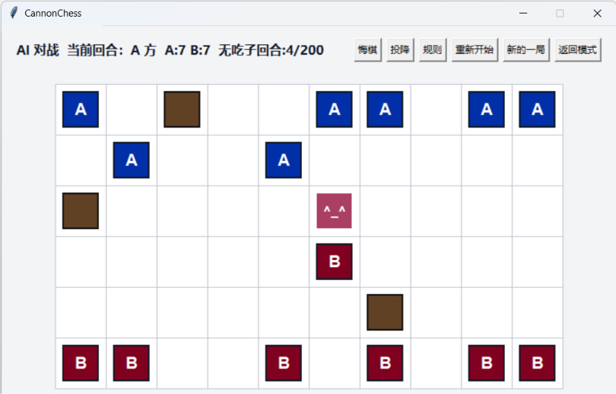
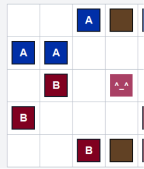
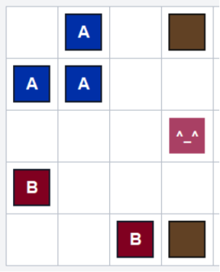
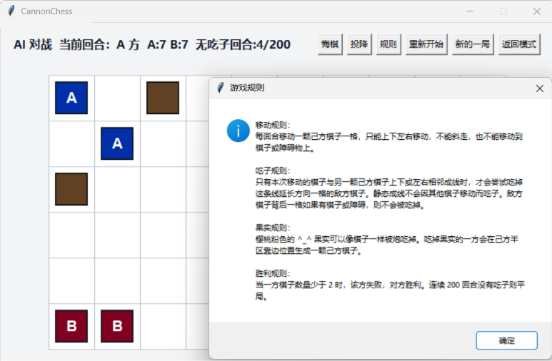
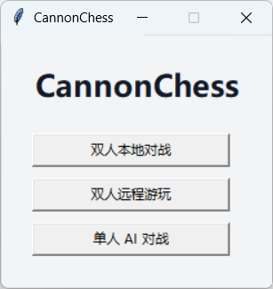
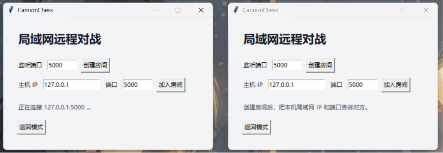
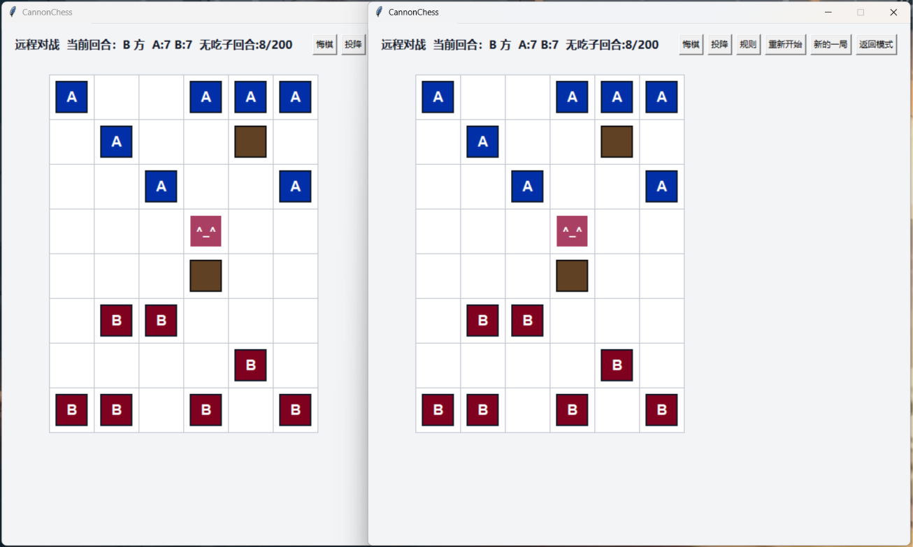

# CannonChess

CannonChess 是一款 Python 棋类游戏原型，中文名为“炮棋”。当前版本已支持图形界面、双人本地对战、单人 AI 对战和局域网 TCP 直连对战。

|  |  |
| :----------------------------------------------------------: | :----------------------------------------------------------: |


## 1. 环境配置

项目使用 Python 3.10 开发，当前不依赖第三方库，只使用 Python 标准库。

推荐在项目根目录运行：

```bash
python run_game.py
```

也可以在安装为包后运行：

```bash
python -m cannonchess
```

运行测试：

```bash
$env:PYTHONPATH="src"
python -m unittest discover -s tests
```

主要代码结构：

- `src/cannonchess/core.py`：核心规则和棋局状态推进。
- `src/cannonchess/gui.py`：Tkinter 图形界面。
- `src/cannonchess/agents.py`：AI 接口和启发式 AI。
- `src/cannonchess/network.py`：局域网 TCP 直连和消息序列化。
- `tests/`：规则、AI 和网络序列化测试。

## 2. 基本规则

棋盘为 `5x5` 到 `10x10` 的矩形棋盘。左下角坐标为 `(0, 0)`，水平向右为 x 正方向，垂直向上为 y 正方向。

|  |
| :----------------------------------------------------------: |

### 棋盘内容：

- A 方棋子：克莱因蓝方块。
- B 方棋子：勃艮第红方块。
- 障碍物：黑色边框的棕色方块。
- 果实：颜色 `#A94064`，显示为 `^_^`。
- 空地：白色格子。

### 每局开始时：

- 棋盘大小随机生成。
- 双方棋子数量相同，均为棋盘短边长 `+1`。
- A 方棋子尽量生成在上侧，B 方棋子尽量生成在下侧。
- 障碍物比例约为 `1/20`，上下半区数量尽量均衡。
- 地图中心附近生成一个果实。
- 先手方随机决定。

### 移动规则：

- 每回合只能移动一颗己方棋子。
- 每次只能上下左右移动一格。
- 不能斜向移动。
- 不能移动到棋子、障碍物或果实所在格。

### 吃子规则：

- 只有本次移动的棋子与另一颗己方棋子上下或左右相邻成线时，才会触发吃子。
- 移动棋子可以是这组相邻棋子的任意一端。
- 成线后，会检查这组相邻棋子两端延长方向一格。
- 如果延长方向一格是敌方棋子或果实，则可以吃掉。
- 静态成线不会因为其他棋子移动而触发吃子。
- 如果目标背后一格存在棋子或障碍物，则触发“两格打不穿”，不会吃掉该目标。

|              （2,4）处A棋子左移一格              | 与(2,3)连线 |                     可以攻击(2,2)处B棋子                     |
| :----------------------------------------------: | :---------: | :----------------------------------------------------------: |
|  |     -->     |  |

### 果实规则：

- 果实不能被棋子直接移动占位。
- 果实可以像棋子一样被炮吃掉。
- 吃掉果实的一方会在己方半区靠边空位生成一颗己方棋子。

### 胜负和平局：

- 当一方棋子数量少于 2 时，该方失败，对方胜利。
- 连续 200 回合没有发生吃子，则判定平局。
- 若某一方当前没有任何合法移动，则另一方继续行动。

规则可随时在局内点击查看规则进行查询，核心就是连线攻击地方棋子：

|  |
| :----------------------------------------------------------: |


## 3. 玩法介绍和对战模式

程序启动后进入模式选择界面。

|  |
| :----------------------------------------------------------: |

当前支持三种模式：

- 双人本地对战：两名玩家使用同一台电脑和鼠标轮流操作。
- 单人 AI 对战：玩家执 A 方，AI 执 B 方。
- 双人远程游玩：两台电脑在同一局域网内通过 TCP 直连对战。

局内操作：

- 点击己方棋子可以选中。
- 选中棋子后，淡黄色格子表示可移动位置。
- 点击可移动位置完成走子。
- “悔棋”会回退上一步。
- “投降”会让当前玩家认输。
- “重新开始”会回到当前地图的初始状态。
- “新的一局”会重新生成随机地图。
- “规则”会显示基础规则说明。
- “返回模式”会回到模式选择界面。

## 4. AI 策略逻辑

AI 暂时使用传统启发式搜索，不依赖训练数据。

AI 的基本流程：

1. 枚举当前所有合法走法。
2. 使用快速指标对走法排序，例如是否能吃子、是否能改善棋子数量差。
3. 只保留少量候选走法，避免大地图中搜索过慢。
4. 对候选走法进行浅层搜索。
5. 搜索过程中使用 alpha-beta 剪枝跳过明显无用的分支。
6. 到达搜索深度上限或终局时，用局面评分函数估算优劣。

评分主要考虑：

- 是否胜利或失败。
- 双方棋子数量差。
- 双方合法移动数量差。
- 当前可吃子机会。
- 接近平局时的局势压力。

这个 AI 的目标是保证游戏体验流畅，因此它不是完整深度搜索。它会比完整搜索弱一些，但在 `10x10` 大棋盘中响应更稳定。

## 5. 局域网联机说明

远程对战使用局域网 TCP 直连，不经过公网服务器。两台电脑需要先通过外部方式处于同一局域网内。

|  |
| :----------------------------------------------------------: |

创建房间：

1. 一名玩家选择“双人远程游玩”。
2. 在“监听端口”中填写端口，默认 `5000`。
3. 点击“创建房间”。
4. 将本机局域网 IP 和端口告诉另一名玩家。

加入房间：

1. 另一名玩家选择“双人远程游玩”。
2. 在“主机 IP”中输入创建方的局域网 IP。
3. 在“端口”中输入创建方监听端口。
4. 点击“加入房间”。

|  |
| :----------------------------------------------------------: |

远程模式规则：

- 创建方执 A 方。
- 加入方执 B 方。
- 创建方生成初始棋局并发送给加入方。
- 双方同步走法、悔棋、重新开始、新的一局和投降状态。
- 该模式面向朋友间游玩，不做反作弊校验。
